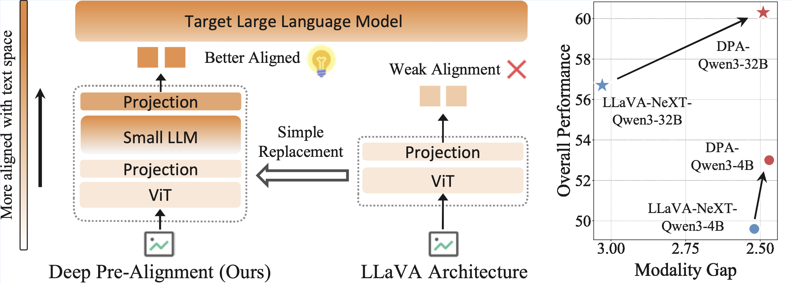
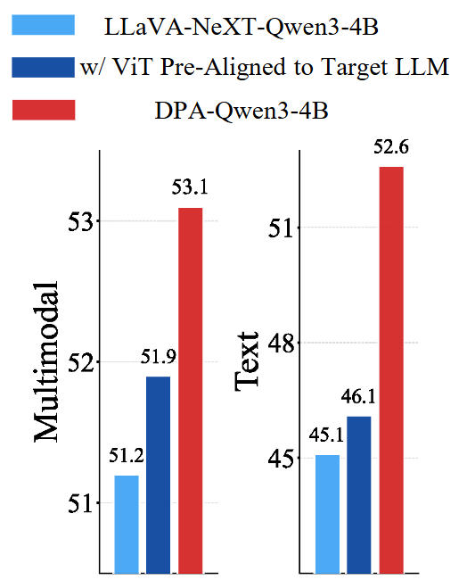

<div align="center" style="font-size: 15pt">

<h2>Deep Pre-Alignment for VLMs</h2>

<a href='https://arxiv.org/abs/2605.15300'></a>
<a href='https://huggingface.co/collections/team6013/dpa'></a>


</div>

## 🎊 News <!-- omit in toc -->

- [2026.05.12] Our DPA is accepted by ICML 2026!
- [2026.03.13] We open-source the code, [weights](https://huggingface.co/collections/team6013/dpa) and data of DPA!


## 📜 Brief Introduction <!-- omit in toc -->

We introduce Deep Pre-Alignment (DPA), a simple yet effective architecture for improving multimodal alignment in VLMs.

<table align="center">
    <p align="center">
      
    </p>
</table>

Instead of directly projecting ViT features into the target language model, DPA employs a small *VLM perceiver* that pre-aligns visual representations with the perceiver LLM text space before they enter the target model. This allows the language model to focus on understanding and reasoning, rather than spending its early layers on modality alignment. Key highlights of DPA include:

* 💪 **Better multimodal performance**. DPA improves results across 8 multimodal benchmarks by +1.9.

<table align="center">
    <p align="center">
      
    </p>
</table>

* 🤝 **Less language capability forgetting**. DPA reduces language performance degradation by 32.9% across text benchmarks.

* ⚡ **High computational efficiency**. DPA introduces only minimal overhead compared to standard VLM architectures. It increases parameters by 1.17× and training cost by 1.14×, while retaining 94% inference throughput.

* 🔧 **Plug-and-play design**. DPA offers a seamless upgrade path for current VLM development, requiring only a modular replacement of the vision encoder.

## 📌Contents <!-- omit in toc -->

- [Dataset](#dataset)
- [Install](#install)
- [Model Weights](#model-weights)
- [Train](#train)
- [Evaluation](#evaluation)
  - [Multimodal evaluation](#Multimodal-evaluation)
  - [Text evaluation](#Text-evaluation)
- [Citation](#citation)

## Dataset

The PT dataset follows exactly [LLaVA-Pretrain](https://huggingface.co/datasets/liuhaotian/LLaVA-Pretrain). We present the SFT dataset in this repository, which is the single-image part of the Stage 3 subset of [MAmmoTH-VL-Instruct-12M](https://huggingface.co/datasets/MAmmoTH-VL/MAmmoTH-VL-Instruct-12M). The dataset contains the image relative paths, conversations and meta infomation, while omits the original images.

## Install

1. Clone this repository.

```bash
git clone https://github.com/THUMAI-Lab/Deep-Pre-Alignment.git
cd Deep-Pre-Alignment
```

2. Install package
```bash
bash setup_env.sh
```

## Model Weights


| Model           | Description    | Download                                                    |
|-----------------|--------------------|:-:|
| DPA 4B init  | Init ckpt of DPA model | [🤗](https://huggingface.co/team6013/DPA-4B-init) |
| DPA 4B  | The main model of DPA | [🤗](https://huggingface.co/team6013/DPA-4B) |


## Train

#### 1. Prepare data

Prepare the [LLaVA-Pretrain](https://huggingface.co/datasets/liuhaotian/LLaVA-Pretrain) data and [MAmmoTH-VL-Instruct-12M](https://huggingface.co/datasets/MAmmoTH-VL/MAmmoTH-VL-Instruct-12M) data. Then fill the paths to the dataset json/jsonl files and image directories in the training scripts in `ms-swift/scripts`.


#### 2. Training

The scripts are designed for 32 A100 GPUs, you can adjust the batch size and gradient accumulation steps for your own hardware.

- **Pretraining**

Clone the DPA-4B-init model to the root of this repository and run the following commands for pre-training:
```bash
bash ms-swift/scripts/PT_DPA_4node.sh
```


- **Fully Fine-tuning**
Fill the path to your pre-trained checkpoint in the SFT scripts in the following scripts, and run:
```bash
bash ms-swift/scripts/SFT_DPA_4node.sh
```


- **LoRA**
Fill the path to your pre-trained checkpoint in the SFT scripts in the following scripts, and run:
```bash
bash ms-swift/scripts/SFT_DPA_4node_lora.sh
```
## Evaluation

### Multimodal Evaluation

#### 1. Inference and evaluation


Please replace `DEFAULT_BASE_URL` and `DEFAULT_API_KEY` in `Multimodal_eval/vlmevalkit/vlmeval/api/ori_gpt_client.py` with a valid API URL and OpenAI api-key.

**Note: The evaluation is based on `gpt-4o` except MMVet that uses `gpt-4-turbo`.**

```bash
bash ms-swift/scripts/eval_DPA.sh "SEEDBench2_Plus MMVet MMStar MMMU_DEV_VAL MathVista_MINI MathVision OCRBench AI2D_TEST" /path/to/father/of/your/checkpoint/directory eval_step start_step poll_interval

```

The last 3 arguments means the script will start evaluating from `start_step`, evaluate every `eval_step` steps and check if there are new checkpoints every `poll_interval` seconds after finishing evaluation (0 for no checking). Inference should be run on 4 A100 GPUs.


#### 2. Summarization

Run the following commands for summarization.

```bash
pip install openpyxl
python summarize_benchmarks_mm.py /path/to/father/of/your/checkpoint/directory
```

### Text Evaluation


1. Inference and evaluation

Please prepare the evaluation data as written in `opencompass/run_model.sh`.

```bash
bash ms-swift/scripts/eval_DPA_text.sh /path/to/father/of/your/checkpoint/directory eval_step1 (eval_step2 ...)
```

Evaluation can be run on 2, 4 or 8 GPUs.


2. Summarization

Run the following commands for summarization.

```bash
python summarize_benchmarks_text.py /path/to/father/of/your/checkpoint/directory
```

## Licenses <!-- omit in toc -->


[](https://github.com/tatsu-lab/stanford_alpaca/blob/main/LICENSE)
[](https://github.com/tatsu-lab/stanford_alpaca/blob/main/DATA_LICENSE)

**Usage and License Notices**: The data, code, and checkpoint are intended and licensed for research use only. They are also restricted to uses that follow the license agreement of Qwen.


## Acknowledgement <!-- omit in toc -->

- [ms-swift](https://github.com/modelscope/ms-swift): The codebase we built upon.
- [VLMEvalKit](https://github.com/open-compass/VLMEvalKit): The evaluation toolkit of multimodal benchmarks.
- [opencompass](https://github.com/open-compass/opencompass): The evaluation toolkit of text benchmarks.\
- [LLaVA](https://github.com/haotian-liu/LLaVA): The pretrain data of DPA.
- [MAmmoTH-VL](https://github.com/MAmmoTH-VL/MAmmoTH-VL): The fine-tuning data of DPA.

## Citation

If you find our model/code/data/paper helpful, please consider cite our papers 📝 and star us ⭐️！ 

```bibtex
@article{
title={Deep Pre-Alignment for {VLM}s},
author={Tianyu Yu and Kechen Fang and Zihao Wan and Kaidong Zhang and Yicheng Zhang and Jun Song and Bo Zheng and Yuan Yao},
booktitle={Forty-third International Conference on Machine Learning},
year={2026},
}
```
